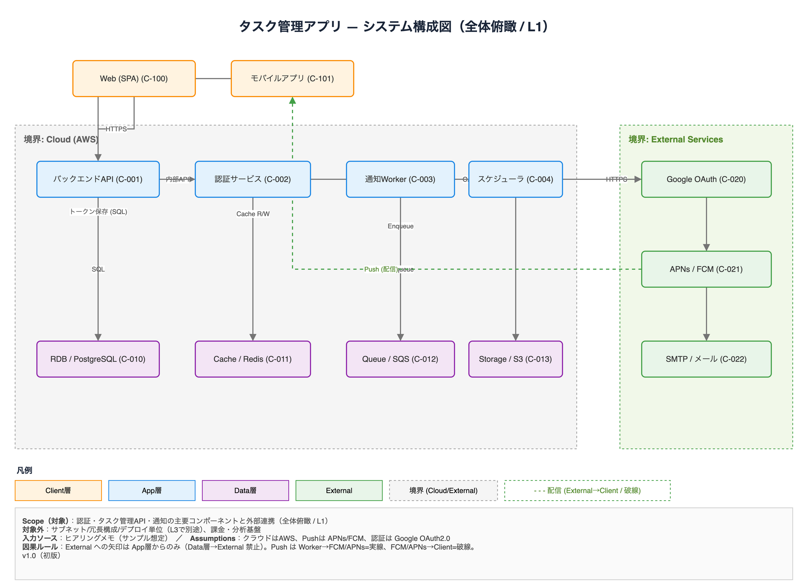
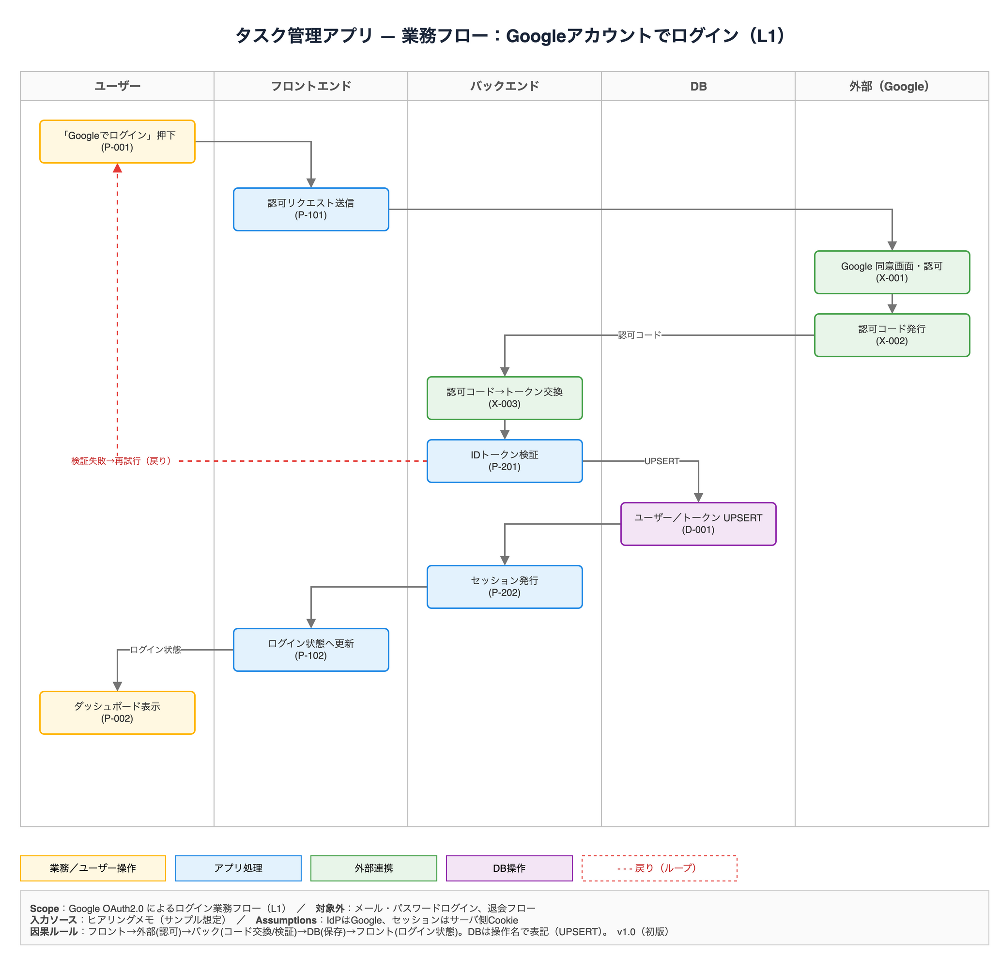
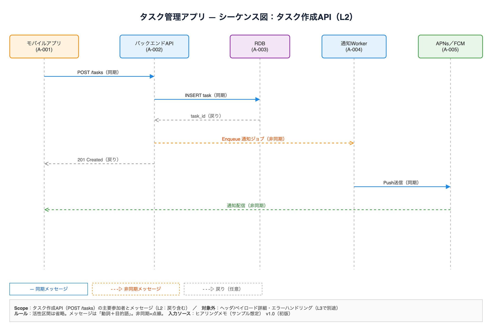
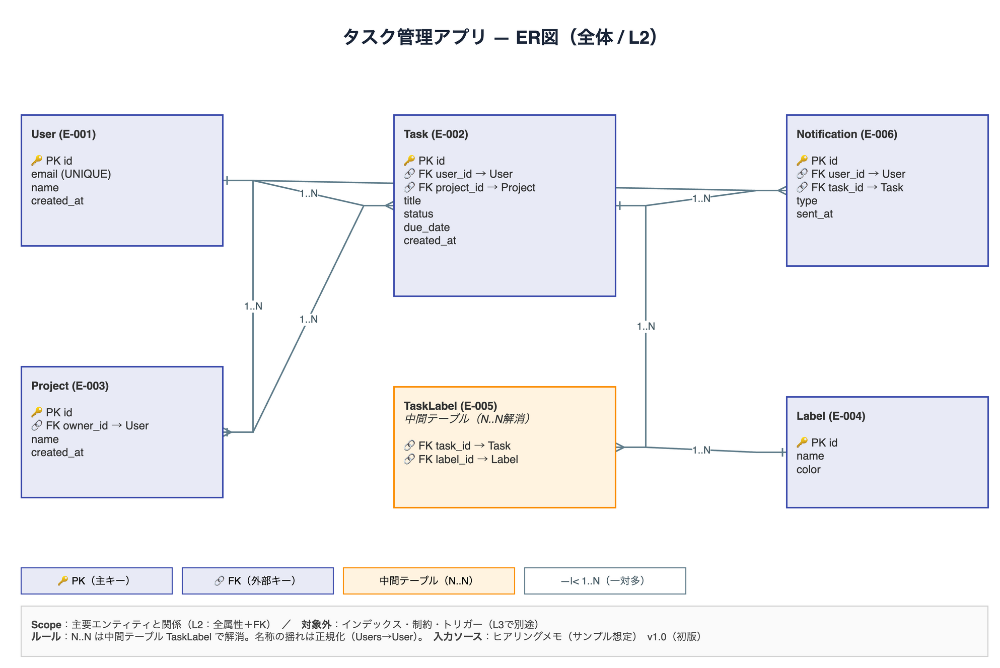
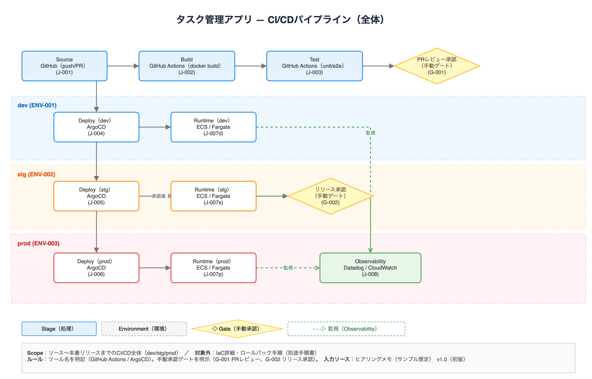
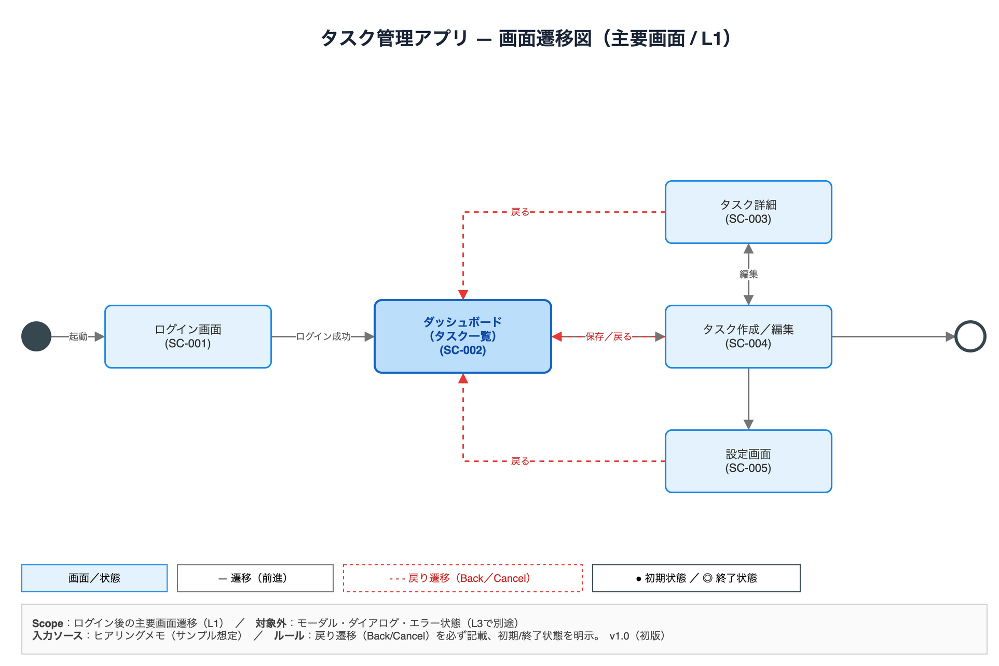
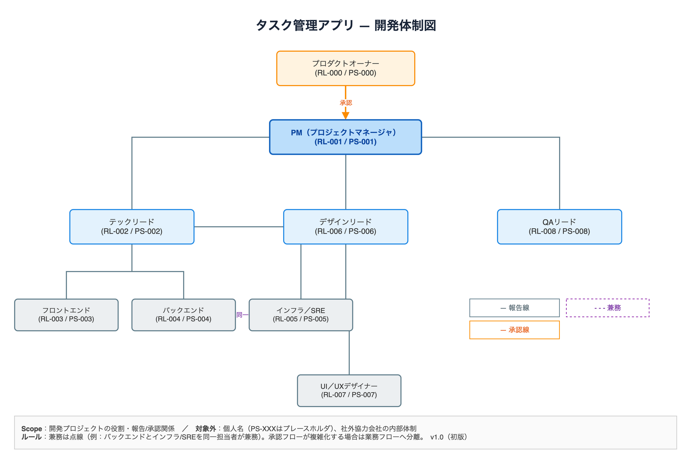

# 📐 drawio-diagram-skills

> **draw.io 図作成スキル集** — 仕様書・議事録・要件から、ルールに沿った高品質な [draw.io](https://www.drawio.com/) 図（業務フロー / システム構成 / ER図 / シーケンス図 / 画面遷移 / 体制図 / CI/CD）を再現性高く生成する [Claude Code](https://claude.com/claude-code) 用スキル集です。

[](LICENSE)
[](https://www.drawio.com/)

「読み手が誤解しない / 意思決定・実装・テストに落とせる」を最優先に、**図種別ごとのレシピ**（抽出対象・レイアウト・色ルール・点線の意味・ID体系・スケール制限）を内蔵。誰が使っても同じ品質の図が作れることを目指しています。

---

## 🖼 生成できる図のサンプル

すべて「タスク管理アプリ」を題材にした、各スキル内蔵テンプレートの完成例です。

### システム構成図 — `create-diagram-d-nodeedge`
Client → App → Data → External の層構造、Cloud/External 境界、OAuth・Push の因果ルール（配信＝破線）。



### 業務フロー（スイムレーン）— `create-diagram-d-flow`
レーン分割、DBは操作名で表記、検証失敗の戻りループ（破線）、OAuth の因果チェーン。



### シーケンス図 — `create-diagram`
同期＝実線 / 非同期＝破線 / 戻り＝破線、活性区間は省略、メッセージは「動詞＋目的語」。



### ER図 — `create-diagram`
PK/FK 明示、中間テーブルで N:N 解消、カーディナリティ（1..N）。



### CI/CD パイプライン — `create-diagram`
dev/stg/prod の環境帯、ツール名明記（GitHub Actions / ArgoCD）、手動承認ゲート（◇）、監視（破線）。



### 画面遷移図 / 体制図 — `create-diagram-d-nodeedge`

| 画面遷移図（戻り遷移＝破線） | 体制図（報告線／承認線／兼務＝破線） |
|:---:|:---:|
|  |  |

---

## 📦 収録スキル

| スキル | 役割 | 対応図種別 | 内蔵テンプレート |
|---|---|---|---|
| [`create-diagram`](skills/create-diagram/) | 汎用（全図種別のレシピを定義） | 業務フロー / 構成図 / ER図 / シーケンス / 画面遷移 / 体制図 / CI/CD | ER図・シーケンス図・CI/CD |
| [`create-diagram-d-flow`](skills/create-diagram-d-flow/) | 業務フロー特化 | 業務フロー / ギャップ分析 | 業務フロー（2種） |
| [`create-diagram-d-nodeedge`](skills/create-diagram-d-nodeedge/) | ノード＋エッジ系特化 | 体制図 / 状態遷移 / ジャーニー / 構成図 / 画面遷移 / インフラ / 移行方式 | システム構成・画面遷移・体制図 |

各スキルの `assets/` に、上記サンプルの `.drawio` テンプレートが入っています。新規作成時は複製して土台に使えます。

---

## ✨ 特長

- **図種別ごとのレシピ** — 抽出対象・レイアウト・色分け・ID体系を型として内蔵し、属人性を排除
- **誤解防止の作法** — タイトル / 凡例 / 注記（Scope・前提・対象外）を必須化
- **点線の意味を固定** — 図種別ごとに「戻り」「配信」「兼務」など意味を一意に定義し、凡例に明記
- **因果関係ルール** — 例：外部サービスへの矢印は App 層からのみ、Push は実線/配信は破線、など破綻しない描き方を強制
- **スケール制限** — 1枚あたりノード40 / エッジ60 を上限とし、超える場合は自然な境界での分割を提案
- **バージョニング** — ファイル名に `_v{MAJOR}.{MINOR}` を付与、上書きせず繰り上げ保存

---

## 🚀 使い方（Claude Code スキルとして）

1. リポジトリを clone し、各スキルを Claude Code のスキルディレクトリに配置します。

   ```bash
   git clone https://github.com/enomoso-pm/drawio-diagram-skills.git
   # 例: 各スキルをグローバルに配置
   cp -r drawio-diagram-skills/skills/* ~/.claude/skills/
   ```

2. Claude Code で「この仕様書から業務フロー図を作って」「タスク管理アプリのER図を draw.io で」のように依頼すると、図種別に応じたスキルが起動します。

3. 生成された `.drawio` を [draw.io](https://www.drawio.com/)（デスクトップ / Web / VSCode拡張）で開いて編集・PNG/SVG/PDF 書き出しができます。

> どの図種別を使うか迷う場合は、別途の `select-diagram`（ルーター）を併用すると最適なワークフローを選定できます（本リポジトリには未収録）。

---

## 🗂 リポジトリ構成

```
drawio-diagram-skills/
├── README.md
├── LICENSE
├── docs/images/                  # サンプル図のスクリーンショット（7種）
└── skills/
    ├── create-diagram/           # 汎用（全レシピ）＋ ER図・シーケンス・CI/CD テンプレ
    ├── create-diagram-d-flow/    # 業務フロー特化 ＋ 業務フローテンプレ
    └── create-diagram-d-nodeedge/# ノード＋エッジ系特化 ＋ 構成図・画面遷移・体制図テンプレ
```

---

## 📄 ライセンス

MIT License. 詳細は [LICENSE](LICENSE) を参照してください。

---

🤖 サンプル図・テンプレート・本 README は [Claude Code](https://claude.com/claude-code) で整備しています。
